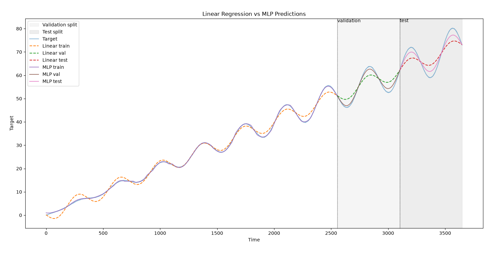

# Research Log - August 16th, 2026

## Today's Goals

The goals for today's work include completing the previously unfinished work on the MLP for the synthetic time series data. A reminder that this implementation was originally intended for after implementing kernel ridge regression (kRR) in the fourth week, but I have intentionally decided to implement it now in the second week before starting kRR implementation in the third week. 

Today's work will be complete once the following benchmarks have been met:
 - a multi-layer perceptron has been implemented with an input layer, two hidden layers, one regression output, and a ReLU activation function.
 - a training loop utilizing the Adam optimizer, MSE loss criterium, and early-stopping (nice-to-have).
 - evaluation metrics MAE, RMSE, and R2 are recorded and compared against the performance of the linear regression model.
 - all tests are passed on predictions, training returning finite predictions, and the expected better performance over a naive mean predictor.
 - A short post-work note records which model performed better and whether the results were understandable and provides insight on originally unknown terms and concepts.

### Files 

 - [src/xai_mini_research/metrics.py](../src/xai_mini_research/metrics.py)
 - [src/xai_mini_research/models/mlp.py](../src/xai_mini_research/models/mlp.py)
 - [tests/test_mlp.py](../tests/test_mlp.py)
 - [src/xai_mini_research/experiments/compare_models.py](../src/xai_mini_research/experiments/compare_models.py)

### Current Uncertainties

I currently have no uncertainties about today's goal. All uncertainties lie on the practical level of implementing good complete tests to make sure the model implemented is correct and complete.

## Post-Work Report

The implementation of the MLP has been complete, and all tests up until this point have passed. To compare the performance of the linear regression model versus the MLP regression model, I have created an experiment script which prints the metrics of all splits for both models. Results have proven that with sufficient training (50 epochs was used here), the MLP regression model see a better MAE, RMSE, and R2 than the linear regression model. The results are shown in the following table below.

### Linear Regression
| Split | MAE | RMSE | R2 |
|---|---|---|---|
| Train | 1.0097 | 1.2934 | 0.9928 |
| Validation | 2.5111 | 2.7967 | 0.7497 |
| Test | 3.2842 | 3.6760 | 0.6918 |

### MLP
| Split | MAE | RMSE | R2 |
|---|---|---|---|
| Train | 0.1596 | 0.2074 | 0.9998 |
| Validation | 0.7693 | 0.8977 | 0.9742 |
| Test | 1.5884 | 1.7992 | 0.9262 |



In order to execute the test, run 
```bash
PYTHONPATH=src python -m xai_mini_research.experiments.compare_models
```

Seeing that the MLP greatly outperforms the linear regression model even on unseen data, I personally consider the implementation of the MLP a success and a clear indicator to move forward with future goals such as the implementation of a kRR model for a more competitive comparison to MLP with its capability to model non-linear functions as opposed to standard linear regression / RR. An early-stop parameter has also been added and implemented to the training function, indicated by the patience argument. An early stopping test has also been implemented with a minimal patience and along with the requirement for exponentially high improvement of loss, which is impossible.
