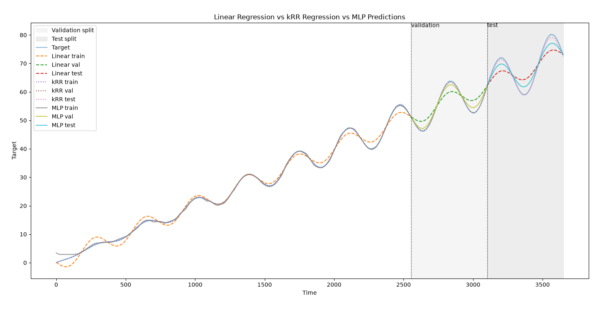

# Research Log - August 19th, 2026

## Today's Goals

The goals for today's work include fully implementing a kernel ridge regression model so that a fairer, more competitive comparison can be made with the MLP model as the RBF kernel can be utilized to allow kRR to learn non-linear regression functions. The metrics of the model will be recorded and compared with the results of the other two models. Thus, the compare_models script will have to be updated.

Today's goals will be considered complete once the following tasks have been finished:
 - the kRR model is fully implemented with passing tests in output shape, finite metrics, and a performance better than at least the mean-predictor on the validation split.
 - An initial grid search of hyperparameter values alpha and gamma is performed: alpha = gamma = [0.01, 0.1, 1.0] on the train and validation splits to determine the best configuration. Edge configurations should see testing with beyond-bounds values (see sklearn documentation for further information).
 - evaluation metrics MAE, RMSE, and R2 are recorded and able to be compared against the metrics of LR and MLP models.
 - script comparing models is properly updated to plot and print the results of the kRR alongside LR and MLP.
 - a post-work report and analysis of the found results from testing the performance of kRR vs. LR and MLP.

Some additional goals that would be nice to have complete include:
 - creating a results/ directory that stores results in JSON files so that future experiments are easily reproducible.
 - preparation for the implementation of adding a shortcut feature into the dataset to train a new MLP.

### Files

 - [src/xai_mini_research/models/krr.py](../src/xai_mini_research/models/krr.py)
 - [tests/test_krr.py](../tests/test_krr.py)
 - [src/xai_mini_research/experiments/compare_models.py](../src/xai_mini_research/experiments/compare_models.py)
 - [src/xai_mini_research/results.py](../src/xai_mini_research/results.py)
 - [results/model_comparison_2026_08_19_19_10_15](../results/model_comparison_2026_08_19_19_10_15.json)

### Current Uncertainties

I currently do not have any large concerns, but I will need to spend some time learning to use sklearn's Kernel Ridge Regression since I have not used sklearn very much prior to this project.

## Post-Work Report

The implementation of the kRR model is complete, and all tests added so far have passed. I have also extended [compare_models.py](../src/xai_mini_research/experiments/compare_models.py) to conduct some very brief tests on finding the best hyperparameters, alpha and gamma, for kRR, and the current results prove very promising. Initially, the grid for the grid search on both hyperparameters was [0.01, 0.1, 1.0], but the printed results show that the best values were 0.01 for both alpha and gamma with the metrics of kRR barely surpassing MLP in the train & validation splits before falling slightly short on the test split. 

I opted to expand the grid for one more run of the experiment to [0.001, 0.005, 0.01, 0.1, 1.0], and, once again, the best alpha and gamma values are both 0.001. The metrics of kRR are now vastly better than MLP's in all splits (see below). I even temporarily increased the number of epochs from 50 to 100 where I noticed the early-stopping activating before even 50 epochs, so I instead chose to increase its patience, but the performance still remained subpar to kRR's. My hypothesis is that given the inherent structure and smoothness of the true data function, the RBF kRR model most likely trains very well to the data, and can therefore achieve a higher performance than the MLP model.

Since the current kRR model's best configurations were deemed to be at the lower edge of the grid, future testing may be conducted to check whether performance can be improved even further; however, the current result is sufficient to continue onward with other project goals.

### Linear Regression
| Split | MAE | RMSE | R2 |
|---|---|---|---|
| Train | 1.0097 | 1.2934 | 0.9928 |
| Validation | 2.5111 | 2.7967 | 0.7497 |
| Test | 3.2842 | 3.6760 | 0.6918 |

### Kernel Ridge Regression, $\alpha = 0.001$, $\gamma = 0.001$
| Split | MAE | RMSE | R2 |
|---|---|---|---|
| Train | 0.0667 | 0.0848 | 1.000 |
| Validation | 0.1302 | 0.1727 | 0.9990 |
| Test | 0.4962 | 0.5799 | 0.9923 |

### MLP
| Split | MAE | RMSE | R2 |
|---|---|---|---|
| Train | 0.2775 | 0.4953 | 0.9989 |
| Validation | 0.8791 | 1.0109 | 0.9673 |
| Test | 1.6890 | 1.9101 | 0.9168 |



In order to execute the test, run 
```bash
PYTHONPATH=src python -m xai_mini_research.experiments.compare_models
```

One thing to note is that the results for MLP have slightly worsened from the last log. I have repeated the test with the current state of the project, and I receive identical results, so I assume the model remains deterministic and stable.

Otherwise, seeing that the implemented kRR model produces comparable / better results than the MLP, I consider today's goal of implementing a kRR model a success. With the proper setup now in place, my next goal will be to implement the ability to generate synthtic time-series data with a shortcut feature to test the detection of spurious correlations. I am currently unsure, however, how such a shortcut can be injected.

The additional goal of implementing a [results.py](../src/xai_mini_research/results.py) script was successful as a trial test successfully created the directory at the top level along with a JSON file storing the results of the experiment. I have made adjustments to the main method in [compare_models.py](../src/xai_mini_research/experiments/compare_models.py), so that I only have to adjust the values of variables that will be saved into the results JSON. 
